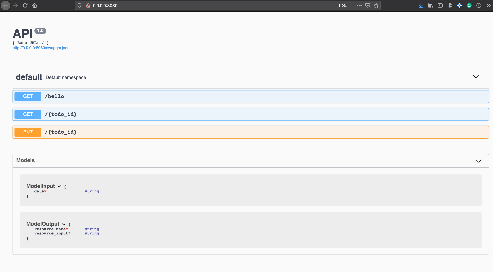
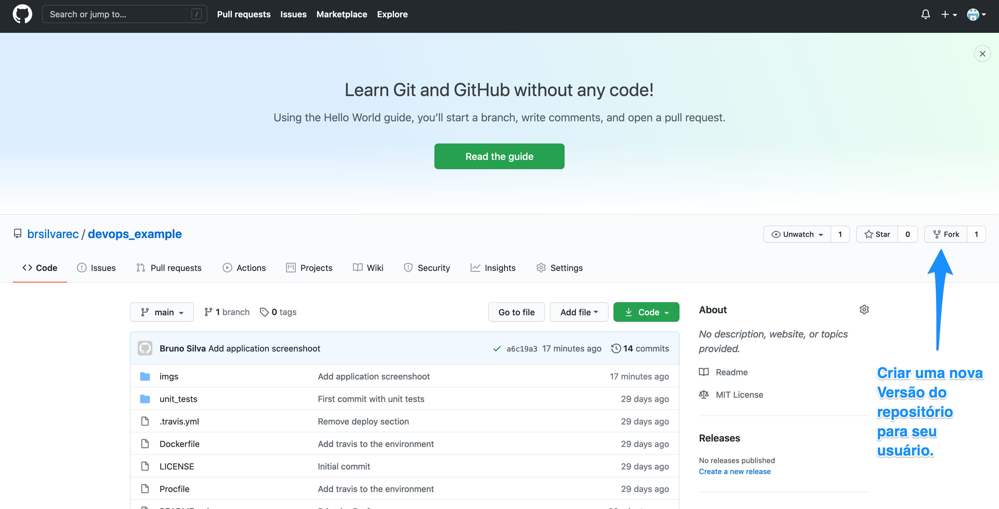

# Devops Example

Esse projeto apresenta uma demonstração de como criar um microserviço simples com integração do travis e cloud foundry. Como o processo de integração e delivery continuos são ferramentas importantes do processo de DevOps, nesse repositório mostramos como integrar tais ferramentas. Criaremos um microserviço (REST) que recebe requisições para leitura e escrita de recursos simples (para fins de demonstração) via métodos get/put. Essa API utiliza a biblioteca `flask_restx` que permite a documentação automática da API via `Swaggers`.


*Microserviço simples. Utilizaremos nessa repositorio o Travis e o Cloud Froundry na nuvem da IBM para implementar o processo de integração contínua.*

## Pré-requisitos

### Contas
1- Conta no Github
https://github.com/

2- Conta no Travis-CI
https://travis-ci.com/

3- Conta no IBM Cloud
https://cloud.ibm.com/

### Ferramentas

1- Github instalado na máquina
https://cli.github.com/manual/installation
https://desktop.github.com/

2- Python 3 e virtual env
https://docs.python.org/3/library/venv.html
https://www.python.org/

3- Ferramentas de linha de comando da IBM Cloud
https://cloud.ibm.com/docs/cli?topic=cli-install-ibmcloud-cli


## Receita para instalação local microsserviço.

Para reprodução desse material, deve-se seguir os seguintes passos.

### 1- Fork do Repositório para seu próprio repositório do GitHub.
Com o seu usuário criado faça um fork do repositório assim como na imagem abaixo.



### 2- Clone do Repositório

Após a criação do FORK, faça o download do projeto para o seu usuário.

```
git clone https://github.com/<NOME_DO_USUARIO_GITHUB>/devops_example.git
```

No exemplo acima, utilizamos o nome do usuario `<NOME_DO_USUARIO>` para referenciar o endereço do repositório no github. No seu caso, é preciso que você troque essa string para o nome do seu usuário. Por exemplo, se criarmos o usuário `temporary-test-username` o endereço do clone será.

```
git clone https://github.com/temporary-test-username/devops_example.git
```

## 3- Criar o ambiente virtual e instalar as dependencias

Entre na pasta do projeto.
```
cd devops_example/
```

Crie o ambiente virtual
```
virtualenv venv --python=python3
```

Ative o ambiente virtual
```
source venv/bin/activate
```

Instale os requisitos do sistema
```
pip install -r requirements.txt
```

### 4- Execute o sistema na sua máquina local

Execute o seguinte comando para execução local do sistema.

```
python application.py
```

Após isso, o microsserviço poderá ser acessado pelo endereço http://0.0.0.0:8080/

A saída do sistema será algo parecido com o que segue.
``` bash
> $ python application.py                                                                     [±main ●]
 * Serving Flask app "application" (lazy loading)
 * Environment: production
   WARNING: This is a development server. Do not use it in a production deployment.
   Use a production WSGI server instead.
 * Debug mode: on
 * Running on http://0.0.0.0:8080/ (Press CTRL+C to quit)
 * Restarting with stat
 * Debugger is active!
 * Debugger PIN: 163-170-228
127.0.0.1 - - [02/Nov/2020 15:46:50] "GET / HTTP/1.1" 200 -
127.0.0.1 - - [02/Nov/2020 15:46:51] "GET /swagger.json HTTP/1.1" 200 -
127.0.0.1 - - [02/Nov/2020 15:48:11] "GET / HTTP/1.1" 200 -
127.0.0.1 - - [02/Nov/2020 15:48:12] "GET /swagger.json HTTP/1.1" 200 -
```
### 5- Execução de testes no sistema

O sistema permite a execução de testes para verificação do funcionamento das chamadas da API (vide Arquivo `unit_tests/test_appllication.py`).

```
pytest -v
```

Exemplo de saída dos testes.

```bash
 > $ pytest -v                                                                                 [±main ●]
================================================ test session starts =================================================
platform darwin -- Python 3.7.3, pytest-6.1.1, py-1.9.0, pluggy-0.13.1 -- /Users/brunosilva/deleteme/devops_example/venv/bin/python3
cachedir: .pytest_cache
rootdir: /Users/brunosilva/deleteme/devops_example
collected 2 items

unit_tests/test_appllication.py::TestApplication::test_hello_world PASSED                                      [ 50%]
unit_tests/test_appllication.py::TestApplication::test_put_get PASSED                                          [100%]

================================================= 2 passed in 0.25s ==================================================
```


## Receita para criação de docker image e execução do serviço via container.

### 1- Criação da imagem do sistema
Para criar uma imagem docker com a aplicação desse repositorio basta executar o comando.

```
docker build --tag devops_example:latest .
```

Esse comando executará via docker os comandos contidos no arquivo `Dockerfile` que basicamente criará um container ubuntu com python e arquivos necessários para execução deste projeto.

### 2- Execução do projeto via docker

```
docker run -it -p 5050:8080 devops_example:latest
```

Com esse comando podemos rodar nosso projeto utilizando containers. Nesse caso, utilizamos um redirecionamento da porta `8080` do container para a porta do sistema local `5050`. Portanto, para acessar o endereço para utilizar o sistema `http://0.0.0.0:5050/`.
